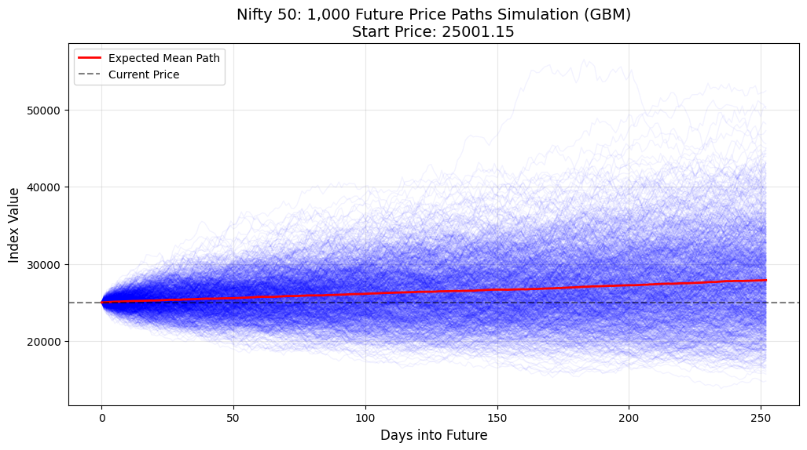

# 📈 NIFTY 50 Stock Price Monte Carlo Simulator

## Overview

This project applies **Monte Carlo simulation using Geometric Brownian Motion (GBM)** to model potential future price paths of the NIFTY 50 index.

The objective is to understand how randomness, volatility, and statistical assumptions influence future price behavior in financial markets.

---

## Problem Statement

Stock prices are inherently uncertain and influenced by multiple factors.
This project explores:

* How can we simulate possible future price movements?
* What range of outcomes can be expected under statistical assumptions?
* How can uncertainty be quantified?

---

## 📊 Dataset

The dataset used in this project is sourced from Kaggle:

- NIFTY 50 Historical Data (25 Years)  
  https://www.kaggle.com/datasets/ashishjangra27/nifty-50-25-yrs-data

It contains historical price data used to compute returns and simulate future price paths.

---

## Approach

* Collected historical price data for NIFTY 50
* Computed daily returns, mean (μ), and volatility (σ)
* Modeled price evolution using **Geometric Brownian Motion (GBM)**
* Simulated **1000+ future price paths** using NumPy
* Visualized trajectories and derived statistical insights

---

## Results

### 📊 Simulation of Future Price Paths



### 📈 Key Metrics

* **Mean Expected Price (1 Year):** ₹27,892.73
* **95% Confidence Interval:** ₹18,225.70 – ₹41,504.25

---

## Interpretation

* The expected trajectory shows moderate growth over time
* A wide confidence interval highlights **significant uncertainty and volatility**
* The simulation captures both optimistic and pessimistic scenarios
* Helps in understanding **risk distribution rather than exact prediction**

---

## Key Insights

* Financial markets exhibit high variability even under controlled assumptions
* Probabilistic modeling provides better perspective than single-point forecasts
* Vectorized computation with NumPy enables efficient large-scale simulations

---

## Limitations

* Assumes **constant volatility and drift** (GBM assumption)
* Does not account for:

  * Sudden market shocks
  * Geopolitical or economic events
  * Structural breaks in the market

> Therefore, results should be interpreted as **theoretical scenarios**, not precise predictions.

---

## Tools & Technologies

* Python
* NumPy
* Matplotlib

---

## Project Structure

```bash id="gbm-structure"
nifty50-monte-carlo-simulator/
│
├── nifty-50-stock-price-monte-carlo-simulator.ipynb
├── dataset/
    ├── nifty-50-historical-dataset.csv
└── assets/
    ├── nifty50_simulation.png
```

---

## Conclusion

This project demonstrates how probabilistic models can be used to simulate and analyze uncertainty in financial markets. It highlights the importance of interpreting outcomes as distributions rather than fixed predictions.

---

## ⚠️ Disclaimer
This project is for educational purposes and does not constitute financial advice.

---

## Note

This project is part of my data science journey, focusing on applying mathematical and statistical concepts to real-world problems.
